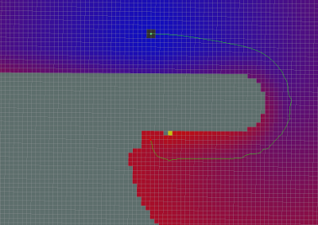

Planner {#mainpage}
===================

[TOC]

# Markdown # {#GeneralConceptsSection}

Most markdown properties are the same, e.g.

* [External links](http://citeseerx.ist.psu.edu/viewdoc/download?doi=10.1.1.88.3884&rep=rep1&type=pdf) ).
* Lists (such as this)
* *Italics* and **Bold**

# Html {#HhtmlSection}

Some representations can also be done with html styles, e.g. <i>italics</i>

## Differences {#DifferencesSection}

Read more about the support for markdown on the official doxygen documentation [here](https://www.stack.nl/~dimitri/doxygen/manual/markdown.html). In brief, some more important points/features:

* You can create a table of contents by adding `[TOC]` at the top and marking each header.
* Internal (relatively located) images:

* Code syntax is a bit different too:

~~~~~~~~~~~~~~~~~~~~~
$ some_command_line_foo
bar
~~~~~~~~~~~~~~~~~~~~~

* Link to other markdown pages by using doxygen references to pages/header tags: e.g. [Other](@ref otherpage)
